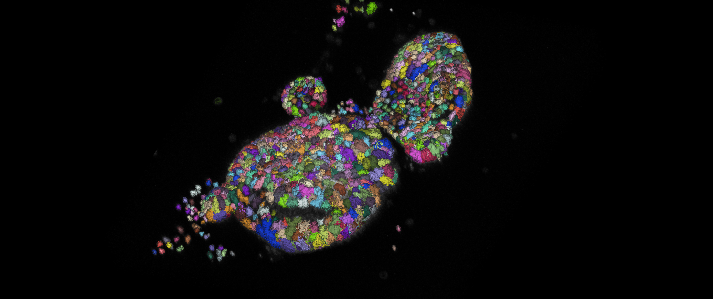

<h1>Checking Nuclear Translocation of YAP Using a Pretrained Cellpose 2.0 Model and Morphological Operations from Pyclesperanto</h1>

This project focuses on analyzing the nuclear translocation of YAP (protein) using a pretrained [Cellpose 2.0](https://www.nature.com/articles/s41592-022-01663-4) model for 3D instance segmentation of nuclei and morphological operations from [pyclesperanto](https://github.com/clEsperanto/pyclesperanto_prototype). The primary goal is to quantify the intensity of YAP in the nucleus and cytoplasm across various experimental conditions, based on this a ratio is calculated to elucidate where YAP localizes.

**Workflow Summary:**

**1. Image Input and Preprocessing:**

- Raw images in .czi format are read, and experimental metadata (experiment, mouse, treatment, and replica IDs) is extracted from filenames.

- Images are sliced for size reduction to improve processing times without lossless compression.

**2. Channel Extraction:**

- Four channels are extracted: UEA-1, YAP, nuclei, and BCAT.

- Each channel is resampled to achieve isotropic data based on metadata scaling.

**3. Nuclei Processing and Segmentation:**

- Nuclei stacks are resampled and background noise is subtracted using top-hat filtering.

- Contrast stretching enhances nuclei visibility.

- Cellpose 2.0 pre-trained 'nuclei' model is used to segment nuclei in 3D.

- Filter out small artifacts and merged nuclei based on volume in order to generate meaningful cytoplams in the next step.

**4. Cytoplasm Simulation:**

- Cytoplasmic regions are simulated by dilating nuclei labels and removing nuclei pixels from the dilated labels.

**5. Intensity Measurement and Data Extraction:**

- YAP intensity is measured within nuclei and cytoplasmic regions using regionprops.

- Data is transformed into Pandas DataFrames, merged, and annotated with experimental metadata.

**6. Output:**

- Final output is a collection of DataFrames containing intensity measurements and calculated nuclei/cytoplasm intensity ratios for YAP across all images.

<h2>Instructions</h2>

1. In order to run these Jupyter notebooks you will need to familiarize yourself with the use of Python virtual environments using Mamba. See instructions [here](https://biapol.github.io/blog/mara_lampert/getting_started_with_mambaforge_and_python/readme.html).

2. To recreate the venv from the environment.yml file stored in the envs folder (recommended) navigate into the envs folder using <code>cd</code> in your console and then execute:

   <code>mamba env create -f environment.yml</code>
