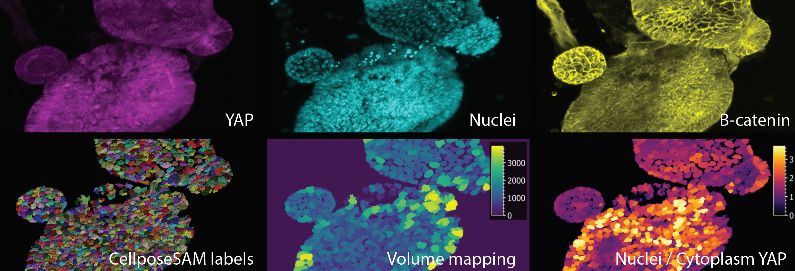
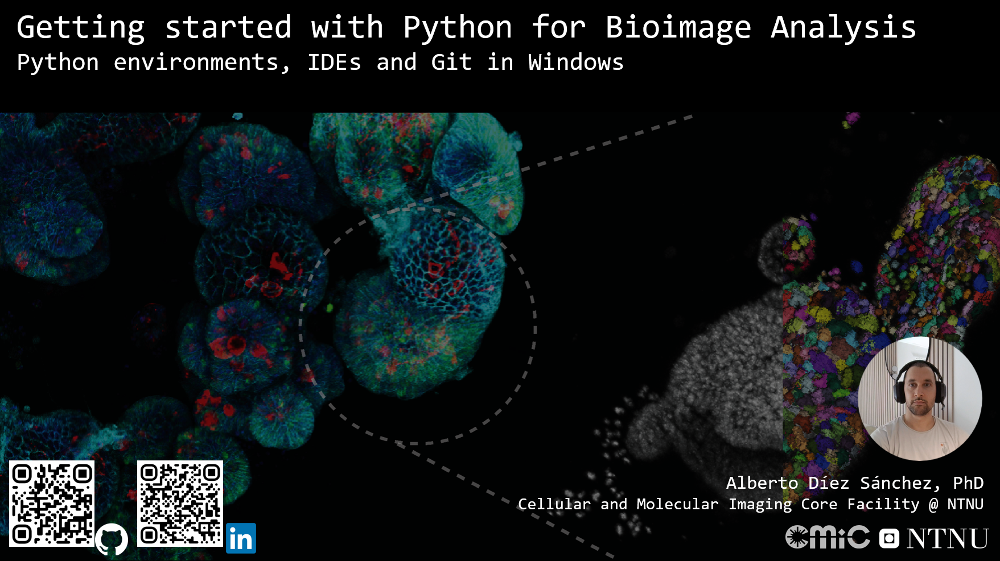

<h1>(YAP-LOC3D) - Quantifying Nuclear Translocation of YAP in 3D Organoids Using CellposeSAM and Pyclesperanto-Based Morphological Operations</h1>

This project focuses on analyzing the nuclear translocation of YAP (protein) using a pretrained [CellposeSAM](https://www.biorxiv.org/content/10.1101/2025.04.28.651001v1) model for 3D instance segmentation of nuclei and morphological operations from [pyclesperanto](https://github.com/clEsperanto/pyclesperanto_prototype) to simulate the cytoplasm surrounding the nuclei. The primary goal is to quantify the intensity of YAP in the nucleus and cytoplasm across various experimental conditions, based on this a ratio is calculated to elucidate where YAP localizes.

<h2>How to install this tool? (Environment setup)</h2>

> [!TIP]
> In order to run these Jupyter notebooks and .py scripts you will need to familiarize yourself with the use of Python virtual environments, IDEs and Git. If you are not familiar with those concepts worry not. Watch the [Before you start (Python, IDE and Git on Windows)](https://youtu.be/tzdFuxF2E3U) video, it will guide you through the necessary steps and cover all basic concepts.
> 
> TL;DR You are busy in the wet lab, skip to the Pixi section below.

|  | Watch on YouTube | Description |
|-------|------------------|-------------|
|  | [Before you start (Python, IDE and Git on Windows)](https://youtu.be/tzdFuxF2E3U) | If you are not familiar with Python, Virtual Environments, Integrated Developer Environments (IDEs) or version control this is the place to start. In this video we will cover how to configure your Windows machine to be able to run this pipeline  |

1. Clone this repository using:

   <code>git clone https://github.com/adiezsanchez/YAP_nuclear_3D_orgs</code>

2. If you do not have git installed you can dowload the code as a .zip file by clicking on the green < > Code button at the upper right corner of the repo.

3. Proceed to the next step using **Pixi** as your environment manager of choice.

|  | Watch on YouTube | Description |
|-------|------------------|-------------|
|  | [Pipeline installation using Pixi](https://youtu.be/tzdFuxF2E3U) | TL;DR You are busy in the wet lab and want to get your hands on in this tool and start using it ASAP.  |

> [!TIP]
> If you want to use the latest in environment managers I do recommend switching to [Pixi](https://pixi.sh/latest/installation/), it will pay off in the short term. 

After installing pixi, type the following command and enjoy the fastest venv manager in the market. After it is done installing your virtual environment it will launch a Jupyter Server in your browser so you can interact with the pipelines.

<code>cd YAP_nuclear_3D_orgs && pixi run lab</code>

<h2>Workflow summary</h2>

**Notebook 1: Single-image QC (`1_SP_3D_Cellpose_YAP_nuc_cyt_ratio.ipynb`)**

- Loads one `.czi` file (`io_utils.list_images`), parses `experiment_id`, `mouse_id`, `treatment_id`, `replica_id`, and visualizes channels in napari.
- Reads voxel size from CZI metadata (`utils.extract_scaling_metadata`) and computes anisotropy correction for 3D CellposeSAM.
- Predicts nuclei labels (`utils.predict_nuclei_labels`) or reloads cached labels (`io_utils.load_precomputed_results_if_available`) and writes outputs to structured folders (`io_utils.ensure_output_dir`).
- Simulates cytoplasm shells by nucleus dilation (`utils.simulate_cytoplasm`) and segments parent organoids from nuclei seeds (`utils.segment_organoids_from_cp_labels`).
- Measures YAP mean intensity and volume in nuclei/cytoplasm (`skimage.measure.regionprops_table`), computes `nuclei_cyto_ratio`, maps nuclei to parent organoids and merges organoid morphology features (`data_analysis_utils.extract_organoid_stats_and_merge`), and enables label-level QC overlays (`utils.map_df_column_to_labels`).

**Notebook 2: Batch processing (`2_BP_3D_Cellpose_YAP_nuc_cyt_ratio.ipynb`)**

- Runs the same core segmentation + quantification logic for all `.czi` images in a folder.
- Reuses cached nuclei labels when present; otherwise infers and saves new labels per image.
- Includes a shape-mismatch safeguard: if cached labels do not match current YAP image shape, labels are recomputed and overwritten.
- Exports one per-label CSV with metadata, nuclei/cytoplasm intensities, nuclei/cytoplasm volumes, `nuclei_cyto_ratio`, and organoid-level context in `results/bp_results/<input_folder>/`.

**Notebook 3: Downstream analysis (`3_Data_analysis_plotting.ipynb`)**

- Loads per-label batch CSVs for WT and tumor datasets.
- Visualizes nuclei volume distributions (`data_analysis_utils.plot_nuclei_volume_distribution`) to set dataset-specific `MIN_MAX_NUCLEI_VOLUME`.
- Filters by nuclei volume and removes orphan nuclei (`organoid_id == 0`) before aggregation.
- Computes technical replicate means (`data_analysis_utils.calculate_technical_replicates_mean_values`) and plots treatment-level boxplots (`data_analysis_utils.plot_boxplots_by_features`).
- Computes biological replicate means (`data_analysis_utils.calculate_biological_replicates_mean_values`), plots treatment-ordered scatter + group means (`data_analysis_utils.plot_scatter_nuclei_cyto_ratio`), and runs Welch t-tests/1-way ANOVA summaries (`data_analysis_utils.calculate_statistical_tests`).

<h2>Raw Data Download (.czi)</h2>

1. [Contact Me](mailto:alberto.d.sanchez@ntnu.no) to obtain a fresh working S3 bucket pre-signed link.

2. Paste the link inside <code>0_data_download.ipynb</code> notebook after <code>presigned_url</code>.

3. Run the notebook to download and extract the data.

<h2>Bioimage Archive deposition</h2>

Placeholder for Bioimage Archive repository

<h2>Materials and Methods: Image Analysis</h2>

3D `.czi` organoid images were analyzed with a CellposeSAM-based nuclei segmentation workflow followed by morphology-guided cytoplasm simulation. For each image, voxel scaling metadata was extracted to compute anisotropy-corrected nuclei inference in 3D. Predicted nuclei labels were optionally filtered by volume, and per-nucleus cytoplasmic shells were generated by controlled dilation. Nuclei were mapped to parent organoid masks to preserve organoid context.

YAP signal quantification was performed as mean intensity in nucleus and simulated cytoplasm for each label, together with nucleus/cytoplasm volumes. A per-label YAP nuclear-to-cytoplasmic ratio (`nuclei_cyto_ratio`) was then computed. Batch outputs were consolidated into CSV files, filtered using volume thresholds and orphan-label exclusion, and summarized at technical-replicate and biological-replicate levels. Treatment-level comparisons were visualized with box/scatter plots and tested using Welch's t-tests and one-way ANOVA.

<h2>How to cite this pipeline</h2>

If you are using this pipeline to analyze your bioimage data you can easily include it in your references following the instructions below:

- For APA and BibTex style scroll to the top of this page, above the Release section and under About click on the cite this repository.

- For APA, Harvard, MLA, Vancouver, Chicago and IEEE styles, visit [Zenodo]() and in the right panel at the bottom you will find the Citation section. 

This is an example from APA, the most popular citation style:

<code>Díez-Sánchez, A. (2026). adiezsanchez/YAP_nuclear_3D_orgs: YAP-LOC3D (v1.0.0). Zenodo. </code>

<h2>Related publications</h2>

Placeholder for publications citing this pipeline
